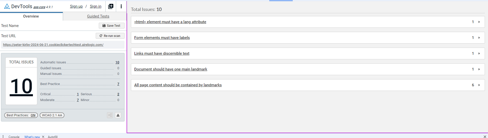
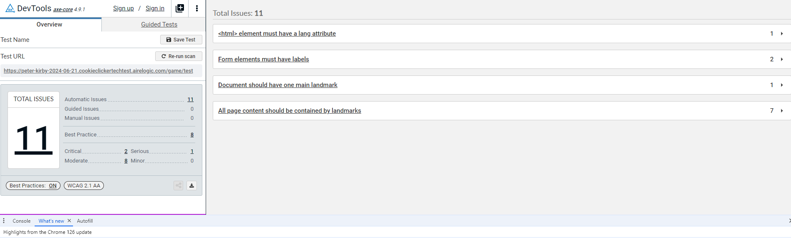

Bug 1: Starting Game Without Name

Summary: When clicking start without filling in a name, the game allows you to proceed without entering anything and doesn’t allow you to click on anything as no string is there.
Steps to Reproduce:
1.	Navigate to the Cookie Clicker game page.
2.	Leave the name input field empty.
3.	Click the "Start!" button.

Expected Result: An error message should be displayed indicating that a name is required, and the game should not start.

Actual Result: The game starts without a name, and no interactions are possible as no string is present.
________________________________________
Bug 2: Adding the Same Username Twice

Summary: When adding the same username twice, it overwrites the current username and starts fresh.
Steps to Reproduce:
1.	Navigate to the Cookie Clicker game page.
2.	Enter a name in the input field and start a game.
3.	Enter the same name in the input field and start another game.

Expected Result: The game should either prevent using the same username twice or append the new session without overwriting.

Actual Result: The game overwrites the existing username and starts a new session.
________________________________________

Bug 3: Cannot Delete a Username

Summary: Users cannot delete a username from the high scores list.
Steps to Reproduce:
1.	Navigate to the Cookie Clicker game page.
2.	Start a game with any name.
3.	Attempt to delete the username from the high scores list.

Expected Result: There should be an option to delete a username from the high scores list.

Actual Result: There is no option to delete a username.
________________________________________
Bug 4: Username with Special Characters

Summary: When a username containing "%" is entered, nothing happens when clicking any buttons.
Steps to Reproduce:
1.	Navigate to the Cookie Clicker game page.
2.	Enter a name containing "%" in the input field and start a game.
3.	Click any button on the game page.

Expected Result: The game should function normally with special characters in the username.

Actual Result: Nothing happens when clicking any buttons.
________________________________________
Bug 5: Main Page Auto Update

Summary: The main page doesn’t auto-update; you need to refresh to see the new values.
Steps to Reproduce:
1.	Navigate to the Cookie Clicker game page.
2.	Start a game and perform any action that should update values (e.g., clicking cookies, selling cookies, buying factories).
3.	Observe the values displayed on the main page.

Expected Result: The main page should auto-update with new values.

Actual Result: The page does not update automatically; you need to refresh to see the new values.
________________________________________
Bug 6: Cannot Sell All Cookies

Summary: You can’t sell all your cookies; it only allows you to sell one less than your total amount.
Steps to Reproduce:
1.	Navigate to the Cookie Clicker game page.
2.	Start a game and collect some cookies.
3.	Attempt to sell all the collected cookies.

Expected Result: You should be able to sell all your cookies.

Actual Result: You can only sell one less than your total amount of cookies.
________________________________________
Bug 7: Entering Game with $0
Summary: When you enter a game with $0, it adds a decimal "$0.0" which then disappears.

Steps to Reproduce:
1.	Navigate to the Cookie Clicker game page.
2.	Start a game with any name.
3.	Observe the money value when it is $0.

Expected Result: The money value should consistently display "$0".

Actual Result: The money value briefly displays as "$0.0" then disappears.
________________________________________
Bug 8: Buying a Factory with No Money
Summary: You can buy a factory with no money and end up in debt.

Steps to Reproduce:
1.	Navigate to the Cookie Clicker game page.
2.	Start a game with any name.
3.	Attempt to buy a factory without having any money.

Expected Result: The game should prevent purchasing a factory without sufficient funds.

Actual Result: The factory is purchased, and the money value goes into debt.
________________________________________
Bug 9: Performance Issue with Factories
Summary: Adding one factory causes a performance issue with the cookie counter. It seems like it should add 1 per second but pauses then jumps a number.

Steps to Reproduce:
1.	Navigate to the Cookie Clicker game page.
2.	Start a game with any name.
3.	Collect cookies and buy one factory.
4.	Observe the cookie counter.

Expected Result: The cookie counter should smoothly add 1 cookie per second.

Actual Result: The cookie counter pauses intermittently and then jumps by a number. 
________________________________________
Bug 10: Adding a Large Character Username Throws the Username Table Titles Off Alignment
Summary: Adding a large character username throws the username table titles off alignment, causing it to be centre aligned.

Steps to Reproduce:
1.	Navigate to the Cookie Clicker game page.
2.	Enter a very long name (e.g., 50+ characters) into the name input field.
3.	Click the "Start!" button.
4.	Observe the alignment of the username table titles in the high scores list.

Expected Result: The username table titles should remain properly aligned regardless of the length of the username.

Actual Result: The username table titles are thrown off alignment and appear to be centre aligned.

Bug 11: Adding an Extremely Large Number of Factories Causes Exponentials in the Display (will only work when you can by factories with not enough funds)
Summary: Adding an extremely large number of factories causes exponential numbers to appear in the game display. There are no limitations on the number of factories you can buy.

Steps to Reproduce:
1.	Navigate to the Cookie Clicker game page.
2.	Start a new game with any name.
3.	Enter a very large number into the "Buy Factories!" input field 
(e.g., 10000000000000000000000000000000000000000).
4.	Click the "Buy Factories!" button.
5.	Observe the display of the number of factories and the cookies count.

Expected Result: The number of factories should be limited to a reasonable amount, and the display should handle large numbers without showing exponentials.

Actual Result: The number of factories is displayed in exponential form, and there are no limitations on the amount of factories you can buy.
________________________________________
Accessibility Issues

Home Page

Game Page

